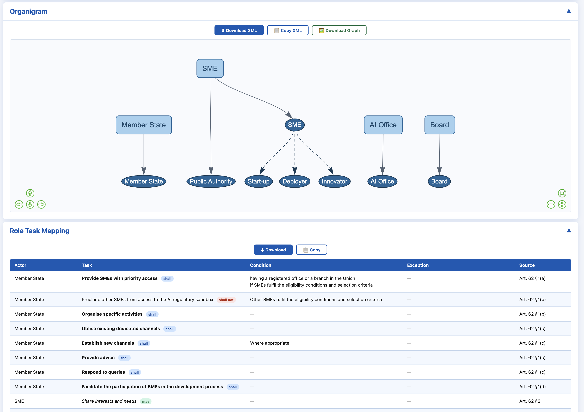

# Automated Extraction of Organizational Information and Process Descriptions from Regulatory Documents

# Automated Extraction of Organizational Information and Process Descriptions from Regulatory Documents


## Short Overview
This repository implements a pipeline for extracting organizational information and process descriptions from regulatory/legal documents. The pipeline consists of three main steps:
1. **Preprocessing**: prepares legal text for downstream extraction by structuring it into articles/paragraphs, handling enumerations, removing boilerplate, and extracting references, see [Preprocessing](src/pipeline/preprocess/doc/README.md).
2. **Organizational Information Extraction & Organigram Generation**: extracts actors (units/roles) and their hierarchies from the preprocessed text to create a structured `organigram.xml` compatible with BPMN/CPEE tools, see [Organizational Information Extraction & Organigram Generation documentation](src/pipeline/organigram/doc/README.md).
3. **Role-Task Mapping**: maps tasks to actors by extracting a structured task list from the preprocessed text and assigning performers based on the generated organigram, resulting in `role_task_mapping.xml`, see [Role-Task Mapping](src/pipeline/role_task_mapping/doc/README.md).
4. **Process Description Generation**: converts the preprocessed text and role-task mapping into a structured natural-language process description that mirrors a BPMN collaboration narrative, see [Process Description Generation](src/pipeline/process_description/doc/README.md).


---

## Prerequisites
Make sure that you have the following installed:
- Python 3.12+
- pip for required Python packages
- Gemini API key set in `.env`

## Installation

1. Clone git repository and navigate to project folder
```bash
git clone .../preprocessing_framework_for_legal_text.git
cd preprocessing_framework_for_legal_text
```

2. Create a virtual environment and activate it
```bash
python3 -m venv .venv
source .venv/bin/activate
python -m pip install --upgrade pip
```

3. Download dependencies
```bash
pip install -r requirements.txt
```

4. Download spacy model and benepar models
```bash
python -m spacy download en_core_web_md
python -c "import benepar; benepar.download('benepar_en3')"
```

5. To run the pipeline, you need to set up API keys for the LLMs you want to use. For example, for Gemini 2.5 Flash, set the `GEMINI_API_KEY` environment variable and `MODEL`:
```bash
export GEMINI_API_KEY='your_gemini_api_key_here'
export MODEL=gemini-2.5-flash
```
6. Now, run the `app.py` to deploy the framework locally.
---

## Project Structure

The repository is organized as follows to separate the core extraction pipeline from evaluation and deployment:

```text
.
├── app.py                  # Main application entry point for deploying the framework locally
├── requirements.txt        # Required Python dependencies
├── src/                    # Source code for the extraction pipeline
│   ├── images/             # UI screenshots and assets
│   └── pipeline/           # Core processing modules
│       ├── preprocess/          # Text structuring, cleaning, and reference extraction
│       ├── organigram/          # Actors extraction and hierarchy generation
│       ├── role_task_mapping/   # Mapping extracted tasks to corresponding performers
│       ├── process_description/ # Natural language execution narrative generation
│       └── run_pipeline.py      # Pipeline execution
└── eval/                   # Evaluation datasets, gold standards, results, and scripts
    ├── dataset/                  # Source regulatory documents
    ├── 1_description_and_bpmn/   # Process model and description evaluation setups
    ├── 2_organigram/             # Organigram component evaluation setups
    └── 3_role_task_mapping/      # Role-task mapping component evaluation setups
```

## Evaluation

The evaluation dataset is located in `eval/dataset`. The dataset includes following regulatory documents:
1. [AI Act Regulation](http://data.europa.eu/eli/reg/2024/1689/oj)
2. [GDPR Regulation](http://data.europa.eu/eli/reg/2016/679/oj)
3. [Driving Licences Directive](http://data.europa.eu/eli/dir/2025/2205/oj)
4. [Health Data Regulation](http://data.europa.eu/eli/reg/2013/604/oj)
5. [CDD Regulation](http://data.europa.eu/eli/dir/2015/849/oj)
6. [eIDAS Regulation](http://data.europa.eu/eli/reg/2014/910/oj)
7. [NIS2 Directive](http://data.europa.eu/eli/dir/2022/2555/oj)
8. [Medical Device Regulation](http://data.europa.eu/eli/reg/2017/745/oj)
9. [Digital Services Act (DSA) Regulation](http://data.europa.eu/eli/reg/2022/2065/oj)
10. [Cybersecurity Act Regulation](http://data.europa.eu/eli/reg/2019/881/oj)

All gold standards can be found as follows:
- **BPMN gold standards**: `eval/1_description_and_bpmn/gold_standard`
- **Organigram gold standards**: `eval/2_organigram/gold_standard`
- **Role-task mapping gold standards**: `eval/3_role_task_mapping/gold_standard_mapping`
- **Process description gold standard**: `eval/1_description_and_bpmn/gold_standard_description`

All **prompts** can be found in `eval/1_description_and_bpmn/prompt`.

All **results** are stored in corresponding subfolders, e.g., in `eval/1_description_and_bpmn/results/Gemini3_1_Pro/process_model_raw/bpmn_completeness_report.xlsx` or `eval/2_organigram/results/Gemini3_1_Pro/evaluation_results_Gemini3_1_Pro.csv`.

### Preprocessed Text Evaluation
Evaluated using raw vs. preprocessed text for BPMN generation for both Gemini 3.1 Pro and Claude Opus 4.6, e.g., see `eval/1_description_and_bpmn/results/Claude_Opus4_6/process_model_raw/bpmn_completeness_report_claude.xlsx`.
Example: 

| Run Type              | Actors Recall | Activities Recall | Events Recall | Data Objects Recall | Conditions Recall | AND Recall | XOR Recall | Actors Absolute | Activities Absolute | Events Absolute | Data Object Absolute | Conditions Absolute | AND Absolute | XOR Absolute |
|-----------------------|---------------|-------------------|---------------|---------------------|-------------------|------------|------------|-----------------|---------------------|-----------------|----------------------|---------------------|--------------|--------------|
| raw (Claude)          | 0,623443      | 0,487992          | 0,251121      | 0,8                 | 0,096508          | 0,5        | 0,203285   | 3.07/5.70       | 10.53/24.4          | 4.07/16.70      | 0/0.50               | 0.57/8.30           | 0.60/2.00    | 2.10/10.14   |
| preprocessed (Claude) | 0,645116      | 0,586329          | 0,197941      | 0,8                 | 0,125278          | 0,9        | 0,199681   | 3.4/7.5.70      | 13.13/24.4          | 3.07/16.70      | 0/5.00               | 0.67/8.30           | 1.80/2.00    | 1.63/14.00   |

### Organigram Evaluation
Make sure to install: 
```bash
pip install -r requirements.txt
python -m spacy download en_core_web_md
```
Single file vs single file evaluation:
```bash
python evaluate_organigrams.py \
    --gold gold_standard/1_AI_Act.xml \
    --pred results/Claude_Opus4_6/raw_text/run_1/1_AI_Act.xml \
    --out evaluation_results_1_AI_Act.csv 
```
Folder vs folder evaluation:
```bash
python evaluate_organigrams.py \
    --gold gold_standard \
    --pred results/Gemini3_1_Pro \
    --out evaluation_results_Gemini3_1_Pro.csv 
```

### Role-Task Mapping Evaluation

Folder vs folder evaluation:
```bash
python evaluate_task_mapping.py \
    --gold gold_standard_mapping \
    --pred results/Claude_Opus4_6 \
    --out evaluation_results_Claude_Opus4_6.csv 
```

### Process Description Evaluation
Evaluates a generated process description (plain text) against a gold-standard
process description (plain text).

```bash
python evaluate_process_description.py --gold gold_standard_description/ --pred results/Claude_Opus4_6/approach_results_descriptions/preprocessed_text
```

Additionally, we reuse CARB evaluation metrics to assess generated BPMNs using raw regulatory text vs. approach's process description, see `eval/1_description_and_bpmn/Statistics_and_Eval_CARB_inspired.ipynb`. 